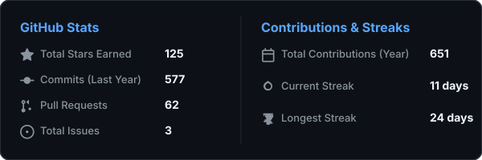

# Srinanth MV
**Full-Stack Developer | AI/LLM | Automation | Security**

  <a href="https://srinanth.vercel.app" target="_blank">Portfolio</a> • 
  <a href="https://linkedin.com/in/srinanth-mv" target="_blank">LinkedIn</a>

---

###  About Me
I am a Computer Science engineering student and Full Stack Developer focused primarily on building web applications and backend systems. My secondary areas of focus include AI/LLM systems, automation workflows, and cybersecurity.

---

###  Tech Stack
- **Languages & Frameworks**: TypeScript, JavaScript, Python, React, SvelteKit, Next.js, Node.js, Express, FastAPI
- **Databases & Infrastructure**: PostgreSQL, MongoDB, SQLite, Supabase, Firebase, Cloudflare Workers (D1/R2), Docker, Git
- **AI & Automation**: LLM Applications, RAG, AI Agent Orchestration, n8n, Google Gemini API
- **Security**: Kali Linux, Burp Suite, Wireshark, CTFs

---

###  What I've Built

####  [Hostel Finder](https://github.com/Srinanth)
*Student accommodation discovery platform serving over 5,000+ monthly visits.*
- Built with SvelteKit and Cloudflare's serverless infrastructure (Workers, D1, R2).
- Built core systems for accommodation discovery, subscription payments, referrals, SEO, and administration.

####  [Assignment Agent](https://github.com/Srinanth)
*AI-powered automation system for processing document and image submissions.*
- Powered by FastAPI, n8n workflows, Python, and the Google Gemini API.
- Automates assignment processing from uploaded documents and images through AI-generated responses and multi-step workflows.

####  [TempSpace](https://github.com/Srinanth)
*Minimalist, authentication-free temporary file-sharing platform.*
- Features short-code based spaces, auto-expiration, and secure file deletion.

####  [Ani-JS](https://github.com/Srinanth)
*Lightweight JavaScript animation library published as an npm package.*
- Provides utility-style animation classes for building interactive UI.

---

###  Stats

  

